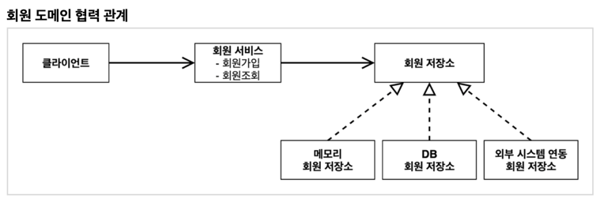
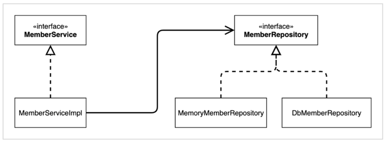

> 팁: IntelliJ Gradle 대신에 자바 직접 실행  
최근 IntelliJ 버전은 Gradle을 통해서 실행 하는 것이 기본 설정이다. 이렇게 하면 실행속도가 느리다.  
다음과 같이 변경하면 자바로 바로 실행해서 실행속도가 더 빠르다.

## 비즈니스 요구사항과 설계
- 회원
  - 회원을 가입하고 조회할 수 있다.
  - 회원은 일반과 VIP 두 가지 등급이 있다.
  - 회원 데이터는 자체 DB를 구축할 수 있고, 외부 시스템과 연동할 수 있다. (미확정) -> 인터페이스 사용

- 주문과 할인 정책
  - 회원은 상품을 주문할 수 있다.
  - 회원 등급에 따라 할인 정책을 적용할 수 있다.
  - 할인 정책은 모든 VIP는 1000원을 할인해주는 고정 금액 할인을 적용해달라. (나중에 변경 될 수 있다.)
  - 할인 정책은 변경 가능성이 높다. 회사의 기본 할인 정책을 아직 정하지 못했고, 오픈 직전까지 고민을 미루고 싶다. 최악의 경우 할인을 적용하지 않을 수 도 있다. (미확정)

요구사항을 보면 회원 데이터, 할인 정책 같은 부분은 지금 결정하기 어려운 부분이다.  
그렇다고 이런 정책이 결정될 때 까지 개발을 무기한 기다릴 수 도 없으므로 인터페이스를 만들고 구현체를 언제든지 갈아끼울 수 있도록 설계하면 된다. 

## 회원 도메인 설계
- 회원 도메인 요구사항
  - 회원을 가입하고 조회할 수 있다.
  - 회원은 일반과 VIP 두 가지 등급이 있다.
  - 회원 데이터는 자체 DB를 구축할 수 있고, 외부 시스템과 연동할 수 있다. (미확정)

회원 도메인 협력 관계

회원 클래스 다이어그램

회원 객체 다이어그램

- 실제 서버에 올라왔을 때, 객체(메모리)간의 참조에 대한 다이어그램
- ex) 클라이언트가 실제 참조하는 주소 값에 있는 인스턴스는 회원 서비스(MemberServiceImpl).. 등
