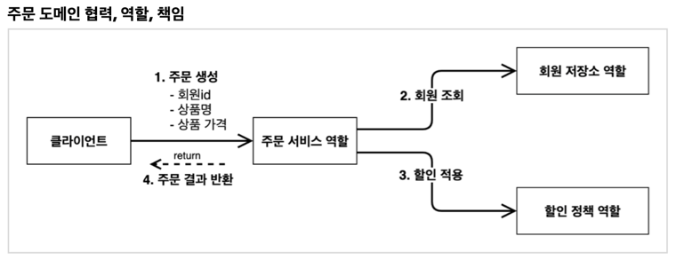
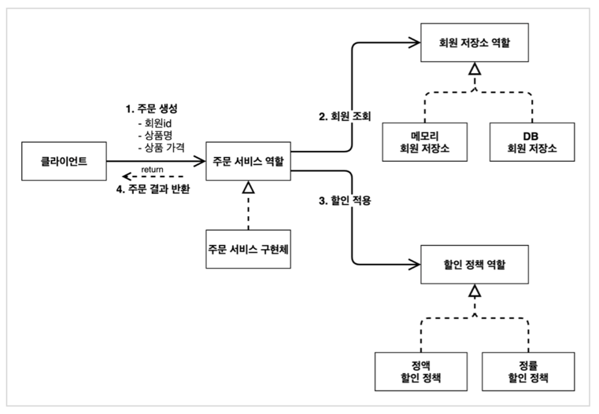
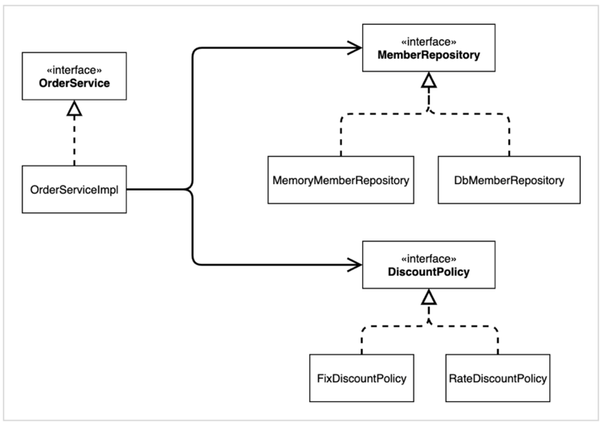
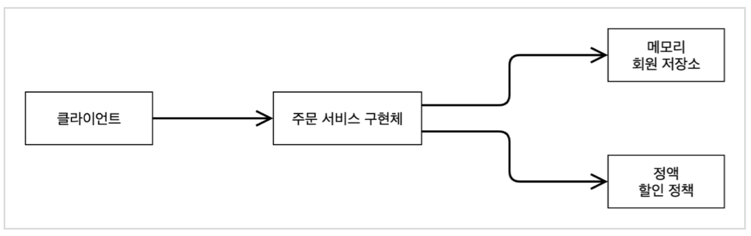
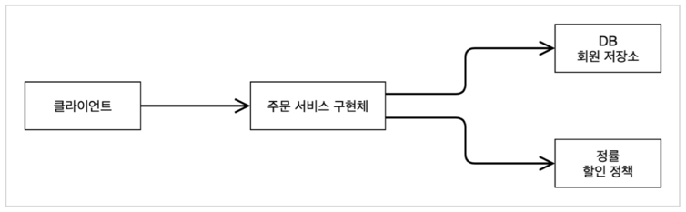

> 팁: IntelliJ Gradle 대신에 자바 직접 실행  
최근 IntelliJ 버전은 Gradle을 통해서 실행 하는 것이 기본 설정이다. 이렇게 하면 실행속도가 느리다.  
다음과 같이 변경하면 자바로 바로 실행해서 실행속도가 더 빠르다.

## 비즈니스 요구사항과 설계
- 회원
  - 회원을 가입하고 조회할 수 있다.
  - 회원은 일반과 VIP 두 가지 등급이 있다.
  - 회원 데이터는 자체 DB를 구축할 수 있고, 외부 시스템과 연동할 수 있다. (미확정) -> 인터페이스 사용

- 주문과 할인 정책
  - 회원은 상품을 주문할 수 있다.
  - 회원 등급에 따라 할인 정책을 적용할 수 있다.
  - 할인 정책은 모든 VIP는 1000원을 할인해주는 고정 금액 할인을 적용해달라. (나중에 변경 될 수 있다.)
  - 할인 정책은 변경 가능성이 높다. 회사의 기본 할인 정책을 아직 정하지 못했고, 오픈 직전까지 고민을 미루고 싶다. 최악의 경우 할인을 적용하지 않을 수 도 있다. (미확정)

요구사항을 보면 회원 데이터, 할인 정책 같은 부분은 지금 결정하기 어려운 부분이다.  
그렇다고 이런 정책이 결정될 때 까지 개발을 무기한 기다릴 수 도 없으므로 인터페이스를 만들고 구현체를 언제든지 갈아끼울 수 있도록 설계하면 된다. 

## 회원 도메인 설계
- 회원 도메인 요구사항
  - 회원을 가입하고 조회할 수 있다.
  - 회원은 일반과 VIP 두 가지 등급이 있다.
  - 회원 데이터는 자체 DB를 구축할 수 있고, 외부 시스템과 연동할 수 있다. (미확정)

회원 도메인 협력 관계

회원 클래스 다이어그램

회원 객체 다이어그램

- 실제 서버에 올라왔을 때, 객체(메모리)간의 참조에 대한 다이어그램
- ex) 클라이언트가 실제 참조하는 주소 값에 있는 인스턴스는 회원 서비스(MemberServiceImpl).. 등

## 주문과 할인 도메인 설계

주문 도메인 협력, 역할, 책임
  
1. 주문 생성: 클라이언트는 주문 서비스에 주문 생성을 요청한다.
2. 회원 조회: 할인을 위해서는 회원 등급이 필요하다. 그래서 주문 서비스는 회원 저장소에서 회원을 조회한다.
3. 할인 적용: 주문 서비스는 회원 등급에 따른 할인 여부를 할인 정책에 위임한다.
4. 주문 결과 반환: 주문 서비스는 할인 결과를 포함한 주문 결과를 반환한다.

주문 도메인 전체
  
역할과 구현을 분리해서 자유롭게 구현 객체를 조립할 수 있게 설계했다. 덕분에 회원 저장소는 물론이고, 할인 정책도 유연하게 변경할 수 있다.  

주문 도메인 클래스 다이아그램

주문 도메인 객체 다이어그램1
  
회원을 메모리에서 조회하고, 정액 할인 정책(고정 금액)을 지원해도 주문 서비스를 변경하지 않아도 된다. 역할들의 협력 관계를 그대로 재사용 할 수 있다.  

주문 도메인 객체 다이어그램2
  
회원을 메모리가 아닌 실제 DB에서 조회하고, 정률 할인 정책(주문 금액에 따라 % 할인)을 지원해도 주문 서비스를 변경하지 않아도 된다. 협력 관계를 그대로 재사용 할 수 있다.  

## 회원 도메인 개발

> 참고: HashMap 은 동시성 이슈가 발생할 수 있다. 이런 경우 ConcurrentHashMap 을 사용해야 한다.

## 주문과 할인 도메인 개발
주문 생성 요청이 오면, 회원 정보를 조회하고, 할인 정책을 적용한 다음 주문 객체를 생성해서 반환한다.  
메모리 회원 리포지토리와, 고정 금액 할인 정책을 구현체로 생성한다.  
> 주문생성(`createOrder()`) 의 설계가 잘되어있다고 했는데, 그 이유는 `OrderService` 입장에서 할인에 대해서는 모르고 `DiscountPolicy`에게 할인에 대한 책임을 넘겨주고 있다. 즉, 단일 책임의 원칙(SRP)이 잘 지켜져 있음. 할인 정책이 변경이 되어도 할인 쪽만 고치고 주문 쪽은 고치지 않아도 되게 된다.
